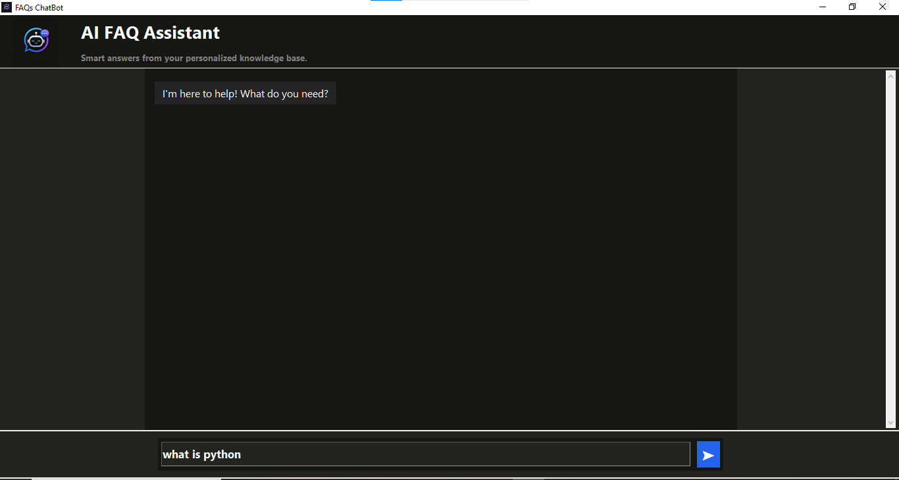
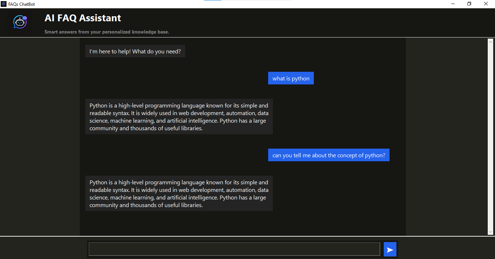
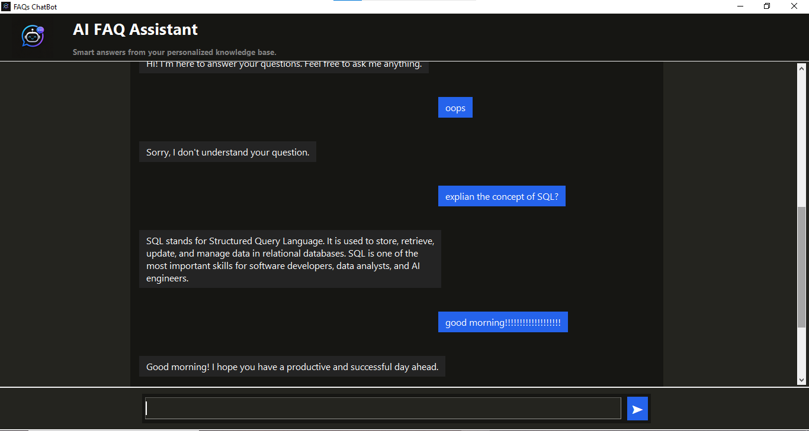

# 🤖 AI FAQ Assistant

> **An Object-Oriented NLP-based FAQ Chatbot built with Python, Tkinter, NLTK, Pandas, and Scikit-learn.**

## 📌 Overview

**AI FAQ Assistant** is a desktop-based FAQ chatbot developed using **Python and Object-Oriented Programming (OOP)**.

The application provides a graphical chat interface where users can ask questions and receive the most relevant answers from a predefined FAQ dataset.

The chatbot uses **Natural Language Processing (NLP)** to process user questions and **TF-IDF with Cosine Similarity** to find the best matching question from the dataset.

The project follows a modular, object-oriented architecture where the GUI, dataset handling, text processing, searching, and chatbot logic are separated into dedicated classes.

---

## ✨ Features

* 🤖 FAQ-based chatbot
* 💬 Interactive desktop chat interface
* 🧱 Fully Object-Oriented architecture
* 🧠 Natural Language Processing using NLTK
* 🧹 Text cleaning and normalization
* 🔤 Lowercase conversion
* ✂️ Tokenization
* 🚫 Stop-word removal
* 📊 TF-IDF vectorization
* 🔎 Cosine Similarity matching
* 🐼 Pandas DataFrame for dataset handling
* 📁 CSV-based FAQ dataset
* 📜 Scrollable chat area
* 🔄 Automatic scrolling
* ⏳ Delayed bot response effect
* 🖼️ Custom application icon
* 🧩 Modular GUI and backend structure

---

## 🛠️ Technologies Used

| Technology      | Purpose                                |
| --------------- | -------------------------------------- |
| 🐍 Python       | Core programming language              |
| 🧱 OOP          | Application architecture               |
| 🖥️ Tkinter     | Desktop GUI                            |
| 🐼 Pandas       | Dataset loading and DataFrame handling |
| 🧠 NLTK         | Natural Language Processing            |
| 📊 Scikit-learn | TF-IDF and Cosine Similarity           |
| 📄 CSV          | FAQ dataset storage                    |

---

# 🏗️ Object-Oriented Architecture

The entire application follows an **Object-Oriented Programming approach**.

Each major responsibility is handled by a separate class.

```text
                         ┌──────────────────┐
                         │     main.py      │
                         │  Application     │
                         │   Entry Point    │
                         └────────┬─────────┘
                                  │
                 ┌────────────────┴────────────────┐
                 │                                 │
                 ▼                                 ▼
        ┌─────────────────┐               ┌─────────────────┐
        │    GUI Layer    │               │   Core Layer    │
        └────────┬────────┘               └────────┬────────┘
                 │                                 │
        ┌────────┼────────┐              ┌─────────┼─────────┐
        ▼        ▼        ▼              ▼         ▼         ▼
     Header  ChatArea  Footer         Chatbot  DataSet   SearchEngine
                                                  Loader       │
                                                               ▼
                                                        TextProcessor
                                                               │
                                                               ▼
                                                        TF-IDF + Cosine
```

### GUI Classes

* **Header** — application logo, title, and subtitle
* **ChatArea** — user/bot messages and scrolling
* **Footer** — user input and Send button
* **Theme** — colors, fonts, backgrounds, and message styling

### Core Classes

* **DataSetLoader** — loads the FAQ dataset into a Pandas DataFrame
* **TextProcessor** — cleans and preprocesses text
* **SearchEngine** — performs TF-IDF vectorization and cosine similarity
* **Chatbot** — controls the overall chatbot workflow

---

# 📂 Project Structure


FAQs ChatBot Project/
│
├── main.py
│
├── core/
│   ├── chat_bot.py
│   ├── dataSet_Loader.py
│   ├── text_processor.py
│   └── search_engine.py
│
├── gui/
│   ├── header.py
│   ├── chat_area.py
│   ├── footer.py
│   └── theme.py
│
├── dataset/
│   └── faq.csv
│
├── assets/
│   └── logo/
│   └── screenshots/
│
├── .gitignore
│
│── requirements.txt
└── README.md
```

## 🧩 Component Responsibilities

| Component       | Responsibility                             |
| --------------- | ------------------------------------------ |
| `main.py`       | Creates objects and starts the application |
| `Header`        | Manages the application header             |
| `ChatArea`      | Displays user and bot messages             |
| `Footer`        | Handles user input and Send button         |
| `Chatbot`       | Controls chatbot workflow                  |
| `DataSetLoader` | Loads FAQ data                             |
| `TextProcessor` | Processes natural language text            |
| `SearchEngine`  | Performs TF-IDF and cosine similarity      |
| `theme.py`      | Stores GUI styling and theme configuration |
| `faq.csv`       | Stores questions and answers               |

---

# 🧠 NLP Pipeline

The chatbot processes the user's question through several NLP steps:

```text
User Question
      │
      ▼
TextProcessor
      │
      ├── Lowercase Conversion
      ├── Text Cleaning
      ├── Tokenization
      └── Stop-word Removal
      │
      ▼
TF-IDF Vectorizer
      │
      ▼
Question Vector
      │
      ▼
Cosine Similarity
      │
      ▼
Best Matching Question
      │
      ▼
FAQ Answer
```

### Example

```text
"What is Python?"
        ↓
"what is python"
        ↓
["what", "is", "python"]
        ↓
["python"]
```

---

# 📊 TF-IDF

**TF-IDF** stands for **Term Frequency–Inverse Document Frequency**.

It converts the FAQ questions into numerical vectors that can be compared mathematically.

```text
FAQ Questions
      │
      ▼
Text Processing
      │
      ▼
TF-IDF Vectorizer
      │
      ▼
TF-IDF Matrix
```

The user's question is also converted into a TF-IDF vector.

---

# 🔎 Cosine Similarity

The chatbot uses **Cosine Similarity** to determine which stored FAQ question is most similar to the user's question.

```text
User Question
      │
      ▼
TF-IDF Vector
      │
      ▼
Compare with FAQ Vectors
      │
      ▼
Similarity Scores
      │
      ▼
Highest Score
      │
      ▼
Best Matching Question
      │
      ▼
FAQ Answer
```

For example:

```text
FAQ 1 → 0.12
FAQ 2 → 0.87
FAQ 3 → 0.21
FAQ 4 → 0.04
```

The chatbot selects **FAQ 2** because it has the highest similarity score.

---

# 🔄 Application Flow

```text
                    USER
                     │
                     ▼
                  Footer
                     │
                     │ Send Message
                     ▼
                 ChatArea
                     │
                     ▼
                  Chatbot
                     │
                     ▼
               SearchEngine
                     │
                     ▼
               TextProcessor
                     │
                     ▼
                TF-IDF
                     │
                     ▼
             Cosine Similarity
                     │
                     ▼
                Best Match
                     │
                     ▼
                  Answer
                     │
                     ▼
                 ChatArea
                     │
                     ▼
                Bot Message
```

This separation keeps the **GUI and backend responsibilities independent** while allowing the different objects to communicate with each other.

---

# 🗃️ Dataset

The chatbot uses a CSV file containing FAQ questions and their corresponding answers.

Example:

```text
Question|Answer
Hello|Hello! It's nice to meet you. How can I help you today?
What is Python?|Python is a high-level programming language...
What is Artificial Intelligence?|Artificial Intelligence is a field of computer science...
What is hardware?|Hardware refers to the physical components of a computer...
```

The project uses `|` as the CSV separator.

```python
pd.read_csv(
    "dataset/faq.csv",
    sep="|"
)
```

---

# 🧱 OOP Concepts Used

The project demonstrates several important Object-Oriented Programming concepts.

### Classes

Different application components are represented using classes:

```python
class Chatbot:
    ...
```

```python
class SearchEngine:
    ...
```

```python
class TextProcessor:
    ...
```

### Objects

Objects are created from these classes and communicate with each other.

```text
Chatbot Object
      │
      ▼
SearchEngine Object
      │
      ▼
TextProcessor Object
```

### Encapsulation

Each class manages its own related data and functionality.

### Separation of Responsibilities

Instead of putting the complete application into one large file, each class has a specific responsibility.

This makes the application easier to maintain, understand, and extend.

---

# ⏳ Response Effect

The chatbot includes a small response delay to create a more natural conversational experience.

```text
User: What is Python?

Bot: Typing...

Bot: Python is a high-level programming language...
```

---

# 🚀 Installation

### 1. Clone the Repository

```bash
git clone <your-repository-url>
```

### 2. Open the Project

```bash
cd "FAQs ChatBot Project"
```

### 3. Install Dependencies

```bash
pip install pandas
pip install nltk
pip install scikit-learn
```

### 4. Download NLTK Resources

Run Python and download the required resources:

```python
import nltk

nltk.download("punkt")
nltk.download("stopwords")
```

### 5. Run the Application

```bash
python main.py
```

---

# 🎯 Project Objectives

This project was developed to practice and demonstrate:

* Python Object-Oriented Programming
* GUI development with Tkinter
* Natural Language Processing
* Text preprocessing
* Dataset handling with Pandas
* TF-IDF vectorization
* Cosine Similarity
* Modular programming
* Frontend-backend communication
* Event-driven programming

---

# 🔮 Future Improvements

Possible future extensions include:

* 🎤 Voice input
* 🔊 Text-to-speech
* 💾 Conversation history
* 🗄️ Database integration
* 🌐 API integration
* 🌍 Multi-language support
* 📈 Chat analytics
* 🧠 Semantic search
* 🤖 Transformer-based NLP
* 🤖 Generative AI integration

---

# 📸 Screenshots







# 👨‍💻 Author

## Syed Muhammad Haleem

Software Engineering Student at University Of Sargodha

### Skills

* Python
* C++
* SQL
* PostgreSQL
* NumPy
* Pandas
* Tkinter
* Object-Oriented Programming

---

# 📜 License

This project was created for **educational and internship purposes**.

You are free to study, modify, and improve the project for learning purposes.
